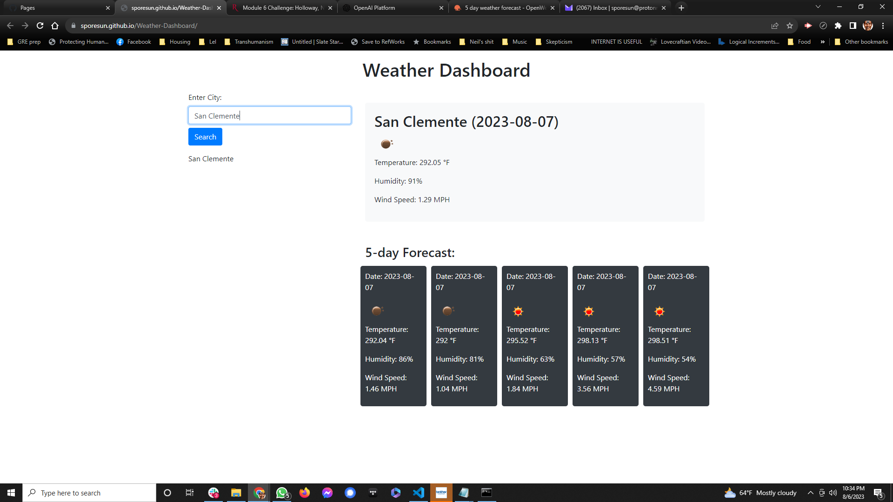

# Weather Dashboard

## Description

I like to travel, and with that comes needing to know what the weather is in multiple cities. I decided to write an app calling on OpenWeather to give me a five day forecast for a vacation. I built this project to learn how to more effectively utilize server-side APIs. I learned how complex API returns are to organize and how to use slice more effectively. It solved much of my concerns around my abilities.

## Installation

N/A

## Usage

Enter https://sporesun.github.io/Weather-Dashboard/ into URL bar. Enter in your city of choice and it will return that day's weather and the forecast for the next 4 days.

## Credits

AskBCS
ChatGPT gave me immediate feedback, advice, and error corrections. Cannot thank this thing enough.

## License

MIT Open License